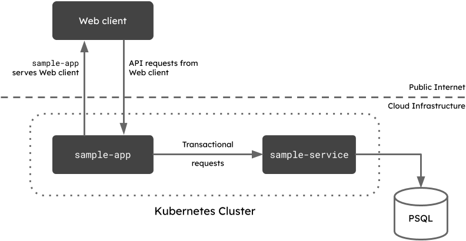

# Demo product frontend

## Overview

This is a simple frontend that displays a list of products and lets you add more. Together with [product-be](https://github.com/walhall-tutorials/product-be), its purpose is to demonstrate how to deploy a simple app on the [Humanitec internal developer platform](https://humanitec.com).

The frontend consists of a client package and a server package. The client package is a React app and is served from `/`. The server package handles API requests from the client on the `/api` endpoint.



## Configuration

You can configure the product frontend with the following environment variables:

| Variable | Description |
|---|---|
| `PRODUCT_BE_SERVER_URL` | The URL for accessing the `product-be` service. |
| `PORT` | The port number where the server should be exposed. Default is `8080`. |


## Running locally (React dev server)

You can run the `product-fe` package in development mode by executing the following two commands in **separate terminal windows:**

```bash
# Start the server
$ cd server
$ PRODUCT_BE_SERVER_URL="http://localhost:8080" PORT=3001 node bin/www
```

```bash
# Start the React dev server
$ cd client
$ npm start
```

This assumes that the `product-be` is running on `localhost` on port `8080`. The `product-fe` server will be running on port `3001`, and the React dev server will be running on port `3000`.
